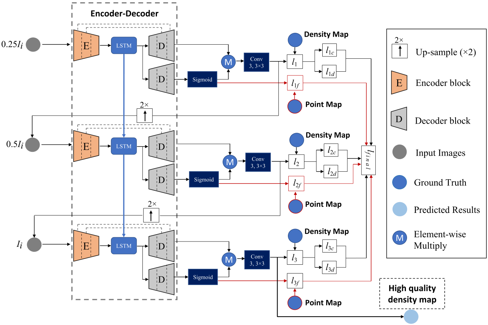

# Scale-Recursive Network with point supervision for crowd scene analysis (Tensorflow Implementation)

## Introduction
This is open source project for crowd analysis. Implement with paper "Scale-Recursive Network with point supervision for crowd scene analysis" from Nankai University.  

## The structure of SRN+PS 
It is similar to a multi-task learning framework.

 

## Preparation
1. ShanghaiTech Dataset. 
ShanghaiTech Dataset makes by Zhang Y, Zhou D, Chen S, et al. For more detail, please refer to paper "Single-Image Crowd Counting via Multi-Column Convolutional Neural Network" and click on [here](https://www.cv-foundation.org/openaccess/content_cvpr_2016/papers/Zhang_Single-Image_Crowd_Counting_CVPR_2016_paper.pdf). 

2. Get dataset and its corresponding map label
Please refer to the instructions under the 'datamaker' path for details.

## Train/Eval/Release
Train is easy, just using following step.

1. Train. Using [train.py](train.py) to train SRN+PS model

```
python train.py --phase train
```

2. Eval. Using [train.py](train.py) to evalute SRN+PS model

```
python train.py --phase test
```

## Citations and Acknowledge

Thanks to the contributors of ACSCP. paper "Crowd Counting via Adversarial Cross-Scale Consistency Pursuit" from Shanghai Jiao Tong University.


If you are using the code here in a publication, please consider citing our paper:

    @article{dong2020scale-recursive,
      title={Scale-Recursive Network with point supervision for crowd scene analysis},
      author={Dong, Zihao et. al},
      journal={Neurocomputing},
      volume={384},
      pages={314--324},
      year={2020},
      publisher={IEEE}
    }
